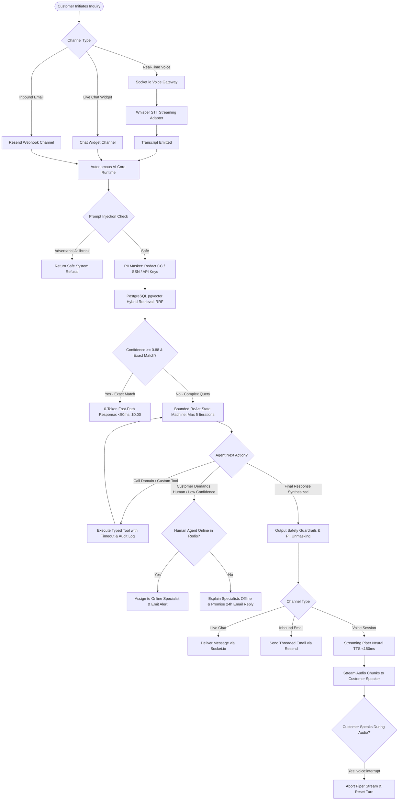
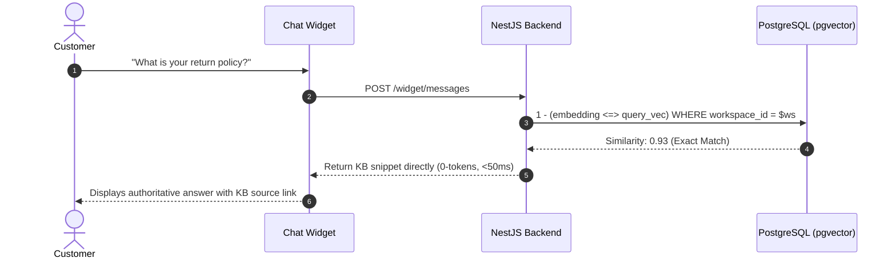
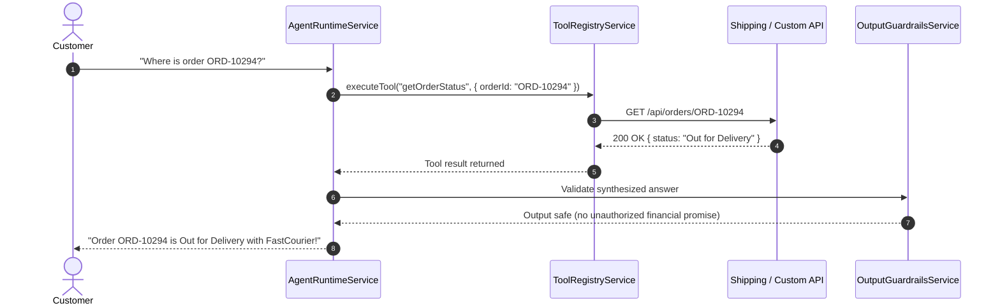
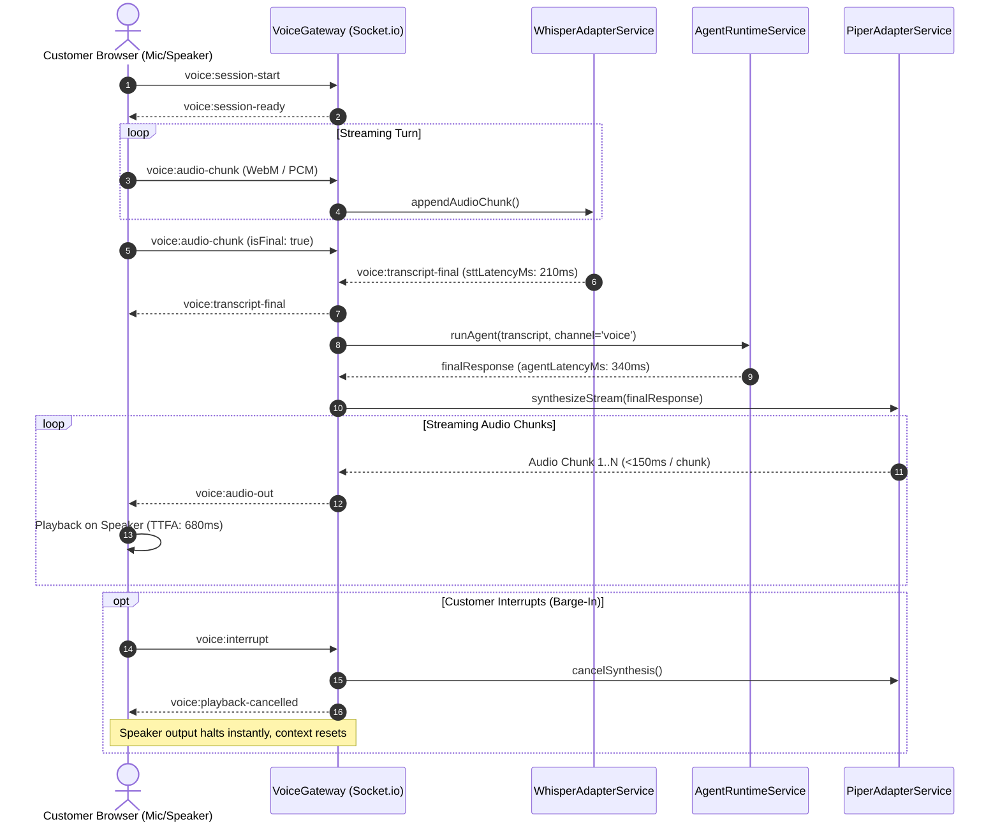

# HelloDesk — Complete User Journeys & End-to-End Flow Architecture

This document outlines the end-to-end user journeys, decision graphs, RAG search mechanics, tool calling pipelines, and multi-agent observability across HelloDesk.

---

## 1. Master System Flowchart

---

## 2. Inbound Chat Scenarios & Decision Logic

### Scenario A: Instant FAQ Resolution (0-Token Fast Path)
1. Customer types: *"What is your return policy for shoes?"*
2. `HybridRetrieverService` executes Reciprocal Rank Fusion combining pgvector cosine distance + PostgreSQL full-text search.
3. High similarity match (> 0.88) found in published article `Return Policy`.
4. **Fast-Path Action**: The exact snippet is returned directly to the widget in **<50ms with 0 LLM tokens burned ($0.00 cost)**.

---

### Scenario B: Dynamic Tool Calling (Live Order Lookup)
1. Customer types: *"Where is my package for order ORD-10294?"*
2. Safety pre-flight passes; pgvector retrieves general shipping policies.
3. LLM decides action: `{"action": "tool_call", "toolName": "getOrderStatus", "parameters": {"orderId": "ORD-10294"}}`.
4. `ToolRegistryService` validates parameters with Zod schema, invokes authoritative endpoint, and records `ToolExecutionLog`.
5. LLM ingests tool result: `{ status: "shipped", trackingNumber: "TRK-98234190", carrier: "FastCourier" }`.
6. LLM synthesizes friendly status with tracking link and delivery estimate.

---

### Scenario C: Custom Plug-and-Play API Tool (Enterprise User Database)
1. Workspace Admin registers a custom API tool `query_user_subscription` pointing to `https://api.mycompany.com/v1/sub` with Auth headers.
2. System tests endpoint with pre-flight verification before saving.
3. When customer asks: *"What plan am I on?"*, AI dynamically extracts customer email and invokes the custom tool.
4. AI responds with current tier and renewal dates without human intervention.

---

### Scenario D: Human Escalation & Offline Fallback
1. Customer explicitly demands: *"I need to speak to a human representative."*
2. `AssignToHumanAgentTool` queries Redis presence `workspace:{id}:presence`.
3. **If Agents are Online**:
   - System assigns conversation to least-busy agent via round-robin.
   - Emits `agent:handoff-alert` real-time notification to the Agent Inbox.
   - AI transitions to Copilot mode (only generates private drafts, never sends customer messages).
4. **If Agents are Offline**:
   - AI responds: *"All human specialists are currently offline. Our team will review your inquiry and email you within 24 hours."*
   - Widget displays email capture form.

---

## 3. Real-Time Autonomous Voice Agent Flow

---

## 4. Multi-Agent & Copilot Interaction Matrix

| Mode | Trigger Condition | AI Role | Customer Visibility | Sender Type |
|---|---|---|:---:|:---:|
| **Autonomous AI Bot** | Unassigned conversation + AI enabled | Answers questions, calls tools, handles voice | **Visible directly** | `bot` |
| **Copilot Smart Draft** | Human agent assigned | Generates private draft suggestions | **Private to agent only** | `agent` (Draft) |
| **Fast-Path Exact Match** | High-confidence FAQ match (>0.88) | Direct KB return (0-token, <50ms) | **Visible directly** | `bot` |
| **Human Specialist** | Human assigned & active | Human types and replies | **Visible directly** | `agent` |
